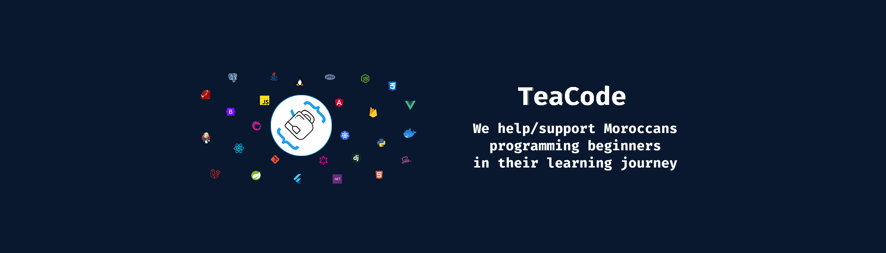

# TeaCode : Turning Tea into Code

## **TEACODE LINKS** 🌐

- Website : [https://teacode.ma](https://teacode.ma/)
- Discord : [https://teacode.ma/join](https://teacode.ma/join)
- Facebook Group : [https://teacode.ma/facebook-group](https://facebook.com/groups/teacode.ma)
- Facebook Page : [https://teacode.ma/facebook](https://facebook.com/teacode.ma)
- YouTube : [https://teacode.ma/youtube](https://youtube.com/teacodema/)
- Twitter : [https://teacode.ma/twitter](https://twitter.com/teacodema)
- Linkedin : [https://teacode.ma/linkedin](https://linkedin.com/company/teacode.ma)
- Github : [https://teacode.ma/github](https://github.com/teacodema)
- Email : [contact@teacode.ma](mailto:contact@teacode.ma)
- How To **Support us** 💜
  - PayPal : [https://teacode.ma/paypal](https://paypal.me/drissboumlik)
  - Patreon : [https://teacode.ma/patreon](https://patreon.com/teacodema/)

## **TEACODE MISSION** 📜

As human beings, we love bringing value to ourselves and to others.
Join us and level up your programming skills in the process, or give 15 to 30 min of your time to help others who need it, a value is added in both ways.

Whether you are learning to code, thinking about it, looking for a job in software development, Join a Moroccan developers community who can help you in your learning journey.
